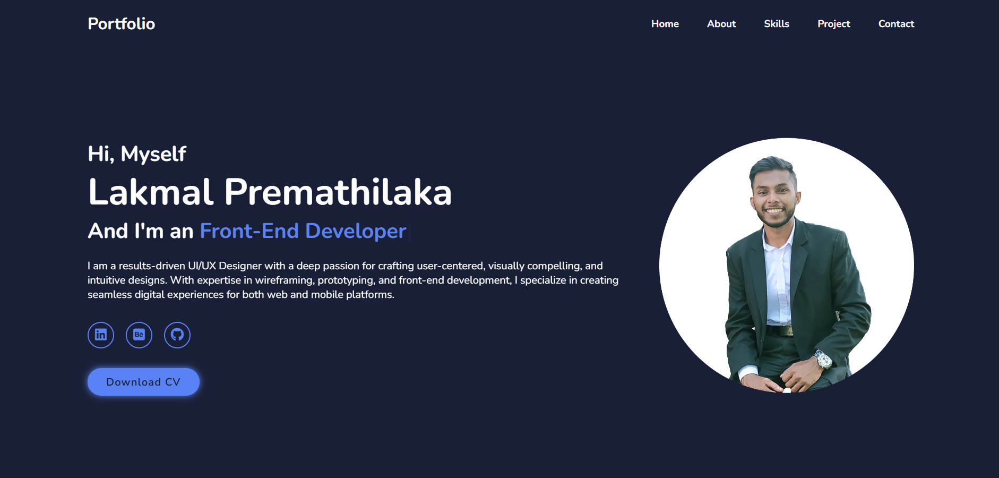
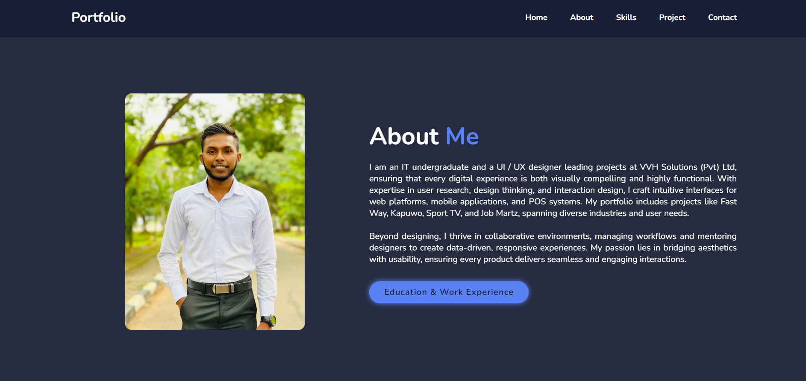
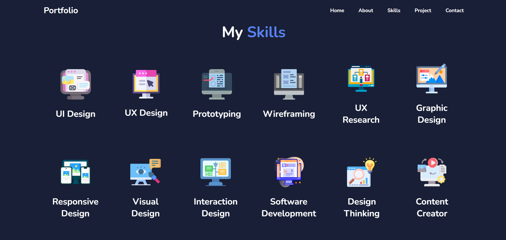
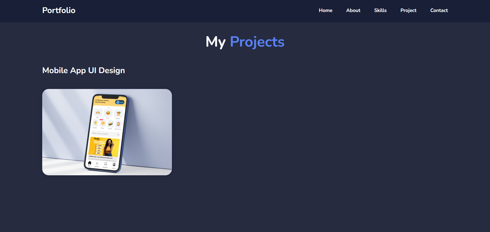
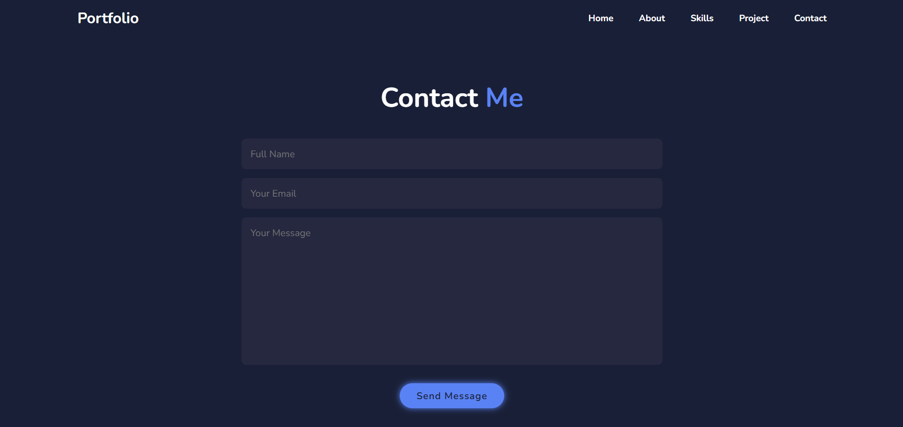

# 🌐 Portfolio Website 

## 📝 Introduction

Welcome to my personal portfolio website! I’m Lakmal Premathilaka, a dedicated and passionate individual with a strong information technology background and a growing interest in software development. This portfolio is a comprehensive showcase of my professional journey, skills, and projects. Here, you'll find detailed insights into my technical abilities, project accomplishments, and professional experiences, all presented through an engaging and user-friendly interface. Whether you're exploring my work for inspiration or considering a collaboration, I hope this site provides a clear view of my capabilities and aspirations. Thank you for visiting.

## ⭐ Features

- **Responsive Design**: Compatible with desktops, tablets, and mobile devices.
- **Project Showcase**: Detailed descriptions and images of my projects.
- **Contact Form**: Visitors can get in touch with me directly through the website.
- **Smooth Navigation**: Easy-to-use navigation bar for seamless browsing.
- **Animations and Effects**: Subtle animations and hover effects for an interactive experience.

## 🔧 Technologies Used

- **HTML5**: For structuring the content.
- **CSS3**: For styling and responsive design.
- **JavaScript**: For interactivity and dynamic content.
- **PHP**: Backend support for the contact form.
- **Netlify**: Hosting the website.

## 📸 Screen Shot

### Home Section

### About Section

### Skills Section

### Project Section

### Contact Section

